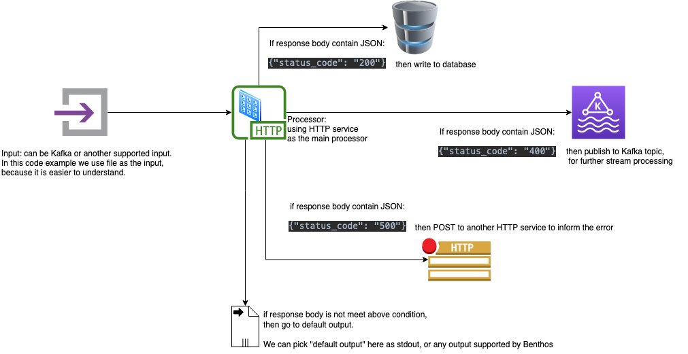

# README

## How to run

```shell

benthos -c config.yaml -r "resources/*.yaml" streams streams/*.yaml
```

## Data flow



### Input

We use `input.txt` mimicking the source of data. We can easily change this using Kafka or another input source.

### Processor

As we want to write to the output based on HTTP response body, we can use `http` processor, 
and then do some conditional checking.

For example, if after POST to `http` service, the response body return:

* response body: `{"status_code": "200"}`
  Then we need to record it into database.
* response body: `{"status_code": "400"}`
  Then need to publish back to another Kafka topic for another processing.
* response body: `{"status_code": "500"}`
  Then need to go some other output (can be POST to another HTTP service to inform this error).
* if `status_code` is not mapping in any `check` condition above, then we can post to some default output.

Please keep in mind that `status_code` here is not HTTP status, but the JSON payload returned as response body.

### Output

We use `stdout` as the example because this is really basic! 
The things that you must pay attention is the `swicth` and `cases[].check` operator in the output.
In this section, you can select the output based on the response body you retrieved from HTTP service.

