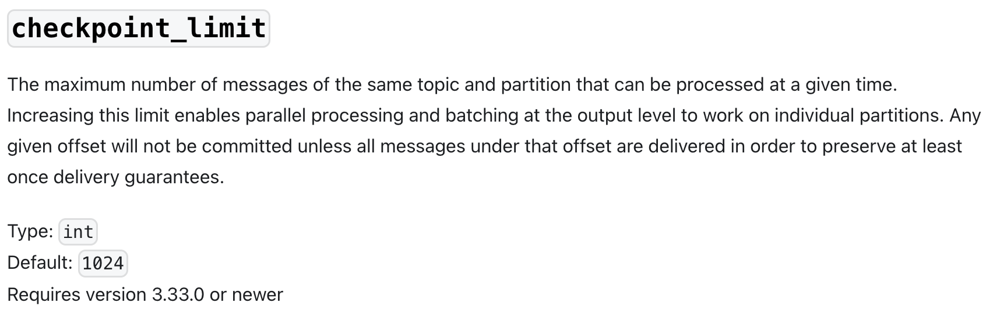
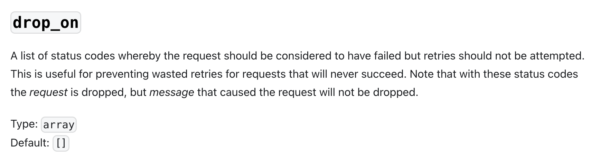
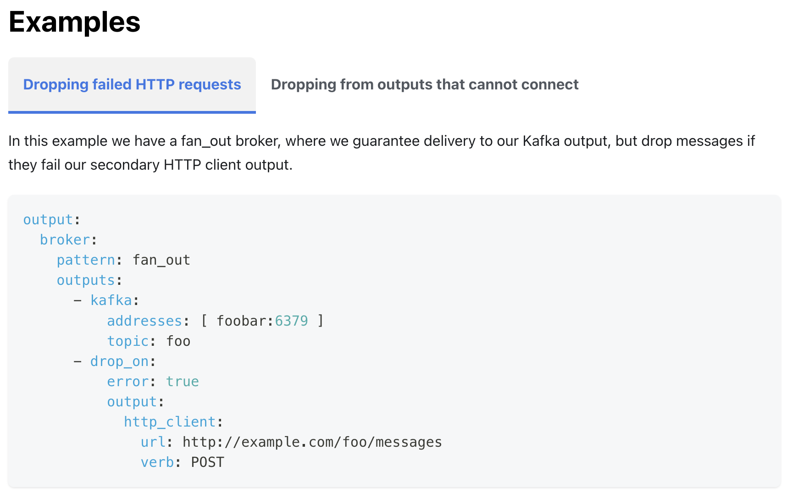
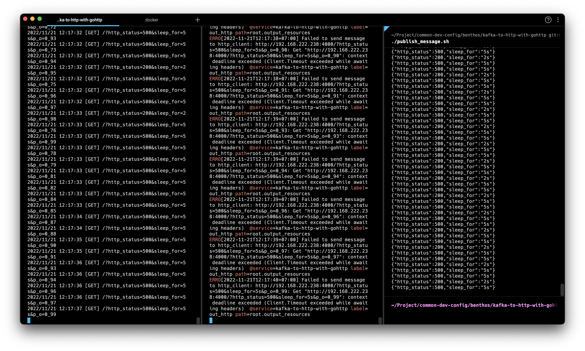
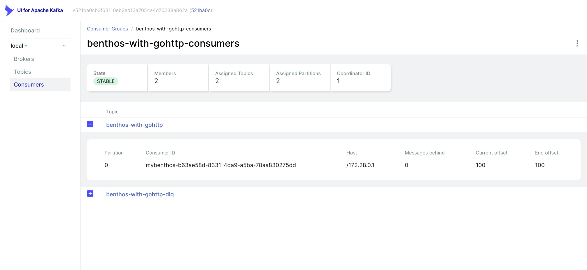

# kafka-to-http-with-gohttp

This part is to prove the assumptions that:

Benthos will hang (and never restart) if we have some failure in the middle of Kafka message operation.
If we use `checkpoint_limit` it will tell Benthos to support parallel processing.
The assumption is, for example we have 10 data in Kafka partition, 
then if Benthos got non-2xx response code in the middle of the message processing, it will not commit to Kafka.

The assumption is based on the Benthos documentation:

[Input Kafka Checkpoint Limit](https://v4.benthos.dev/docs/components/inputs/kafka/#checkpoint_limit)

```
The maximum number of messages of the same topic and partition that can be processed at a given time.
Increasing this limit enables parallel processing and batching at the output level to work on individual partitions.
Any given offset will not be committed unless all messages under that offset are delivered in order to preserve at least once delivery guarantees.
```



And in [`http_client` `drop_on`](https://v4.benthos.dev/docs/components/outputs/http_client/#drop_on):

```
A list of status codes whereby the request should be considered to have failed but retries should not be attempted.
This is useful for preventing wasted retries for requests that will never succeed.
Note that with these status codes the request is dropped, but message that caused the request will not be dropped.
```




In addition, we see this passage on [`drop_on` example](https://v4.benthos.dev/docs/components/outputs/drop_on#examples)
which adding the degree of the assumption that Benthos will never commit the message if something in between failed.




## How to Prove
To prove the real Benthos use-case, we do following step:

1. We create the topic name `benthos-with-gohttp` with only 1 partition.

2. Then, we publish 100 data with following message using `publish_message.sh`.

It publish http status 200 each 3 iteration with timeout 2s, otherwise it will publish http status 500 with timeout 5s.

If it true that Benthos will suspend when some message is failed, 
the Kafka lag must never be zero and Benthos will hang after processing first message because Bentgos will timeout while waiting the response. 
Or if Benthos still capable to wait, then it will get 500 Internal Server Error by the server.

```shell
Bash version 3.2.57(1)-release...
{"http_status":500,"sleep_for":"5s"}
{"http_status":500,"sleep_for":"5s"}
{"http_status":200,"sleep_for":"2s"}
{"http_status":500,"sleep_for":"5s"}
{"http_status":500,"sleep_for":"5s"}
{"http_status":200,"sleep_for":"2s"}
{"http_status":500,"sleep_for":"5s"}
{"http_status":500,"sleep_for":"5s"}
{"http_status":200,"sleep_for":"2s"}
{"http_status":500,"sleep_for":"5s"}
{"http_status":500,"sleep_for":"5s"}
...
```

3. Then we create the HTTP Server using Golang to mock the http status returned by server. 
If Benthos request using `http_status=200` in their query param, server will return HTTP 200 OK. 
Similarly, if user request `http_status=500` in their query param, then server will return HTTP 500 Internal Server Error.

We also doing sleep for `sleep_for` requested in query param. For example, if user request `sleep_for=5s`, 
server will wait 5 seconds before returning the requested HTTP status. 
This is to test what happen if Benthos got request timeout, for example when we set in Benthos `http_client.timeout` to 3s,
but server need 5s to fulfill the request, then it considered as timeout.


## How to tell if it is the real Benthos behavior

If after publish 100 messages with the payload, we need to see the Kafka lag. 
If it zero, then Benthos already process all the messages, otherwise Benthos considered hang and we need another approach to handle this.

If Benthos need to wait all 

## Result

After running the Golang server, then running Benthos, and then publish the message (all in order step),
we found that Benthos is successful to do the job without hang. 



In above screenshot, we see in the left panel that Go server receives the message with offset 93 first, 
then receives the message with offset 73. This proves that Benthos is literally doing the parallel processing on consumed message.

```shell
2022/11/21 12:17:32 [GET] /?http_status=500&sleep_for=5s&p_o=0_93
2022/11/21 12:17:32 [GET] /?http_status=500&sleep_for=5s&p_o=0_73
```


Also, here's the screenshot of Kafka lag. Zero value meaning that all messages are already consumed by the consumer group `benthos-with-gohttp-consumers`.

